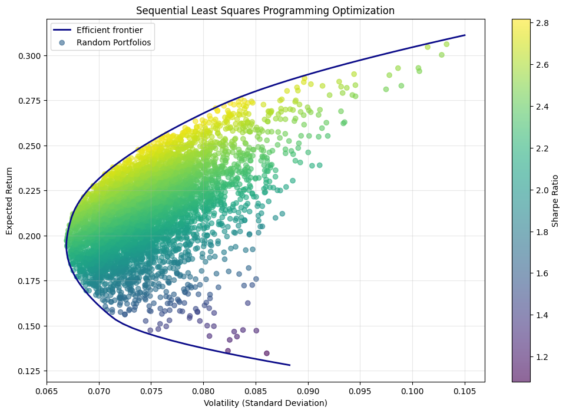
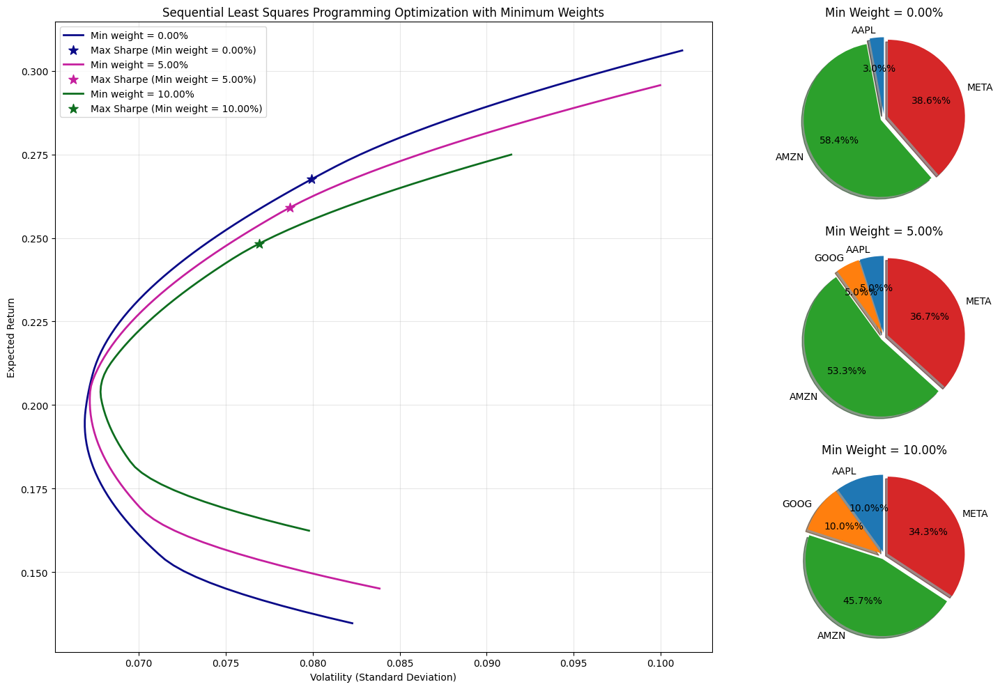

## HTML Version
You can view the HTML version of this notebook [here](https://endregb.github.io/portfolio-optimization/notebook.html).
 
# Portfolio Optimization Without Shorting

A practical exploration of portfolio optimization under long-only constraints.  
Combines Monte Carlo simulation, Markowitz theory, and numerical optimization (SLSQP).  
Built as a personal tool to understand the efficient frontier for real-world investing.

---

## Methods

- Monte Carlo simulation of random portfolios
- Analytical Markowitz mean-variance optimization
- Numerical optimization using SLSQP with:
  - Minimum and maximum weight constraints
  - Sector constraints (optional)
  - Sharpe ratio maximization

## Visualizations

- Efficient frontiers under varying constraints
- Capital Market Line (CML) and Sharpe-optimal portfolios
- Pie charts of asset allocations
- Side-by-side comparisons of how constraints affect shape and allocation




## Limitations

- Based on historical mean returns and covariances
- Assumes normally distributed returns
- No transaction costs or turnover limits yet

## Future Work

- Add more advanced models (e.g., Black-Litterman model)
- Include transaction costs / turnover constraints

## Motivation

This project began as a personal tool to help me understand how portfolio optimization works in practice, not just in theory. I wanted to learn how to construct efficient, long-only portfolios using Python, based on historical data.
Since I don’t short assets in my own investing, I focused on long-only constraints throughout. I’ve gradually added features like minimum/maximum weight constraints and visualizations to help understand the tradeoffs involved.
The notebook is designed to be a clear, practical reference that can be extended in the future as I explore more advanced models.


## Getting Started

```bash
pip install -r requirements.txt
